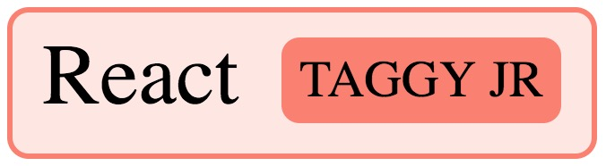

#### A simple zero-dependency React component for tagging a user-defined entity.

## Demo
Visit the [demo page](https://johncmunson.github.io/react-taggy-jr/) and click on the components on the left side of the page.

## Install

`npm i --save react-taggy-jr` or `yarn add react-taggy-jr`

## Basic Usage

#### ES6
`import TaggyJr from 'react-taggy-jr'`

#### Node Modules
`const TaggyJr = require('react-taggy-jr').default`

#### Props
- `text`: (string) The text getting tagged.
- `type`: (string) The name of the tag.
- `color`: (object) Provide an RGB color. Defaults to grey if not provided.

#### Example usage
```javascript
<TaggyJr
    text={'fifteen'}
    type={'NUMBER'}
    color={{
        r: 45,
        g: 120,
        b: 90
    }}
/>
```

## Contributions

All contributors will receive proper attribution, as outlined in the awesome [All-Contributors](https://github.com/kentcdodds/all-contributors) specification developed by open-source superstar [Kent C. Dodds](https://twitter.com/kentcdodds?lang=en).

## Development Setup

This component was bootstrapped with [React CDK](https://github.com/kadirahq/react-cdk). Please refer to [React CDK documentation](https://github.com/kadirahq/react-cdk)) to get started with the development.

## Inspiration

This project is originally a fork of [displacy-ent](https://github.com/explosion/displacy-ent) by the guys over at [ExplosionAI](https://explosion.ai/). Now with 100% more React awesomeness!

## License

*react-taggy-jr* is available under BSD. See LICENSE for more details.
